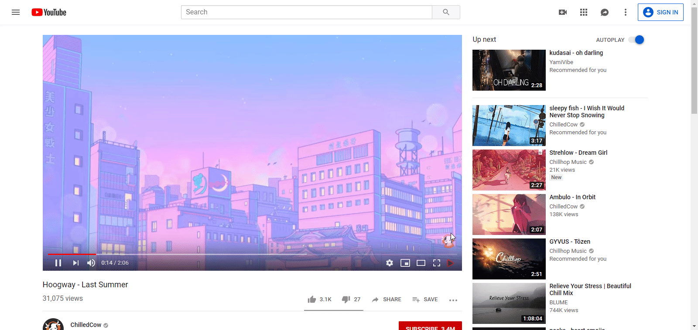

# MPV button chrome extension

**Extension that adds a button to youtube videos to 'play in external MPV player'**



## Installation
[https://chrome.google.com/webstore/detail/kffgglnfnodcijffgdfbcaedicddooem](https://chrome.google.com/webstore/detail/kffgglnfnodcijffgdfbcaedicddooem)

## Dependencies
- [Mpvbutton](https://github.com/XENKing/mpvbutton) 
- Node.js

## Build
**Install deps**
1. Run code
    ```
    $ git clone https://github.com/XENKing/mpvbutton-chrome
    $ cd mpvbutton-chrome
    $ npm install
    $ npm run build
    ```
2. Open [chrome extension page](chrome://extensions/) and click on 'load unpacked extension' and point it at the 'extension' folder in this repo

Extension based on [playback-chrome](https://github.com/maxogden/playback-chrome) repository
